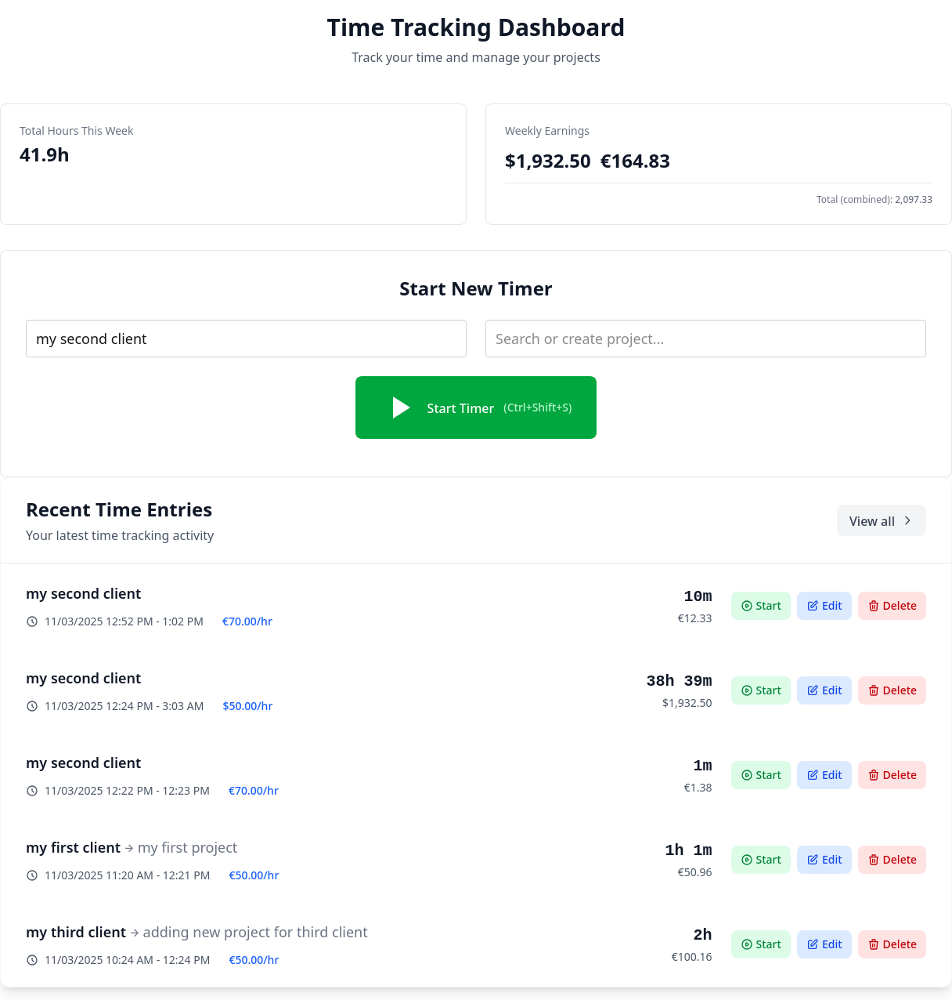
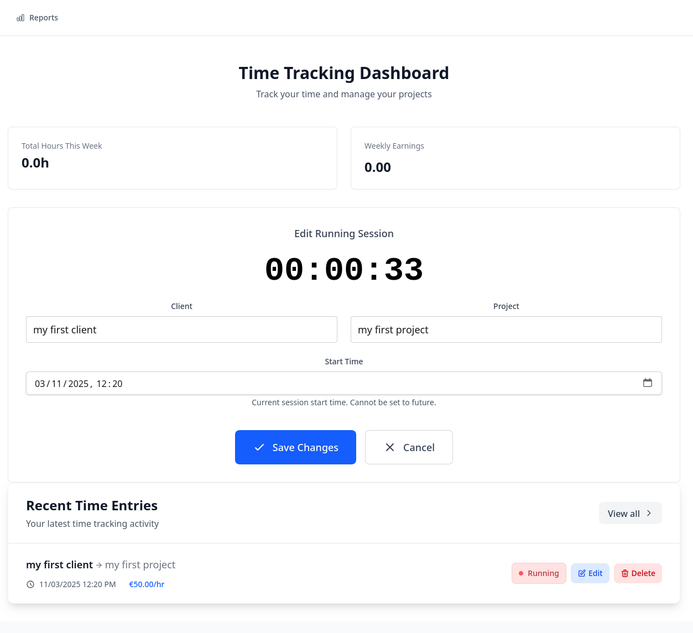
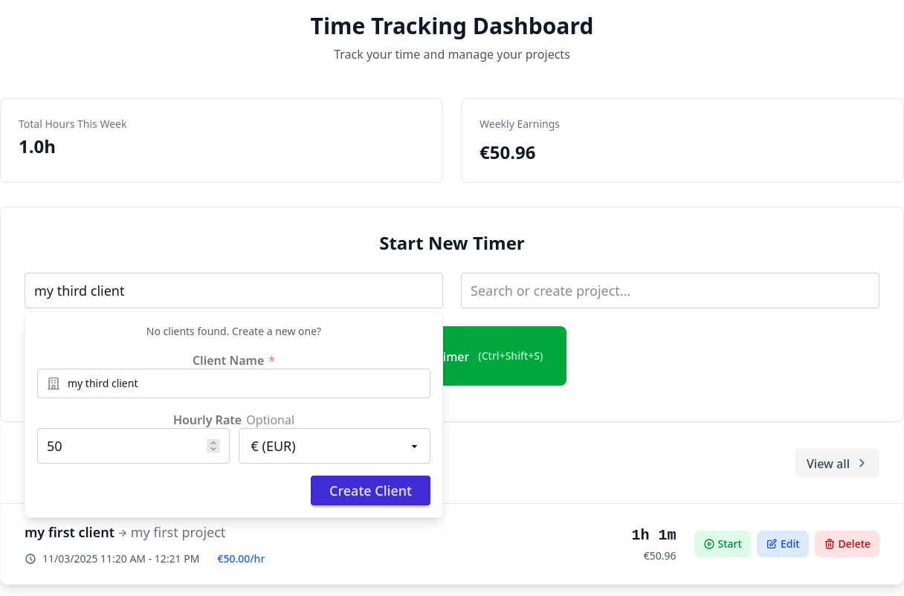
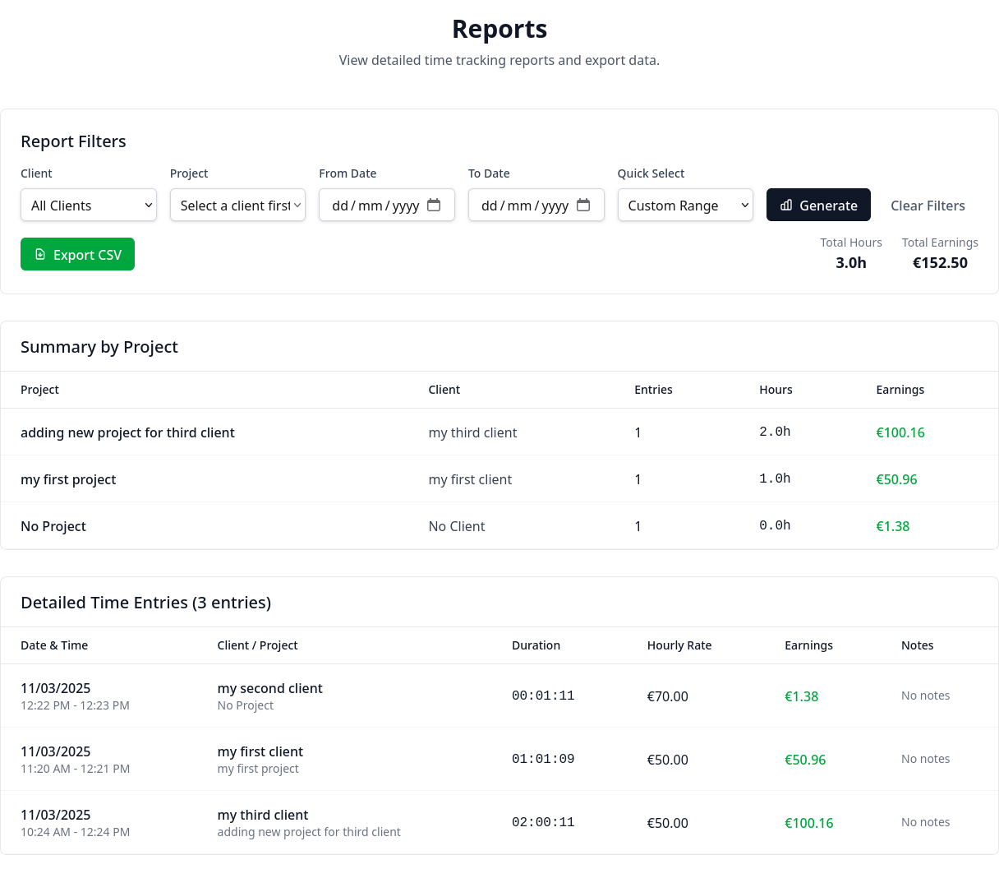

# SimpleTime OS

**SimpleTime — don't spend time tracking time.**

Timer • Clients • Projects • Reports

Time tracking for freelancers and consultants who bill by the hour. Self-host forever. Built with Laravel 12 and Hotwire. O'Saasy licensed—free to self-host forever, SaaS rights reserved.



## Why SimpleTime OS?

Most time trackers overwhelm you with 100+ features you'll never use. SimpleTime OS gives you exactly what you need—timer, clients, projects, reports—nothing more.

**Own your data. Pay nothing. Forever.**

## Why Self-Host Your Time Tracker?

Self-hosting isn't just about saving money—it's about control, privacy, and freedom from vendor lock-in.

| Traditional SaaS Trackers | SimpleTime OS (Self-Hosted) |
|---------------------------|------------------------------|
| ✗ Recurring subscriptions forever | ✓ **$0 forever** |
| ✗ 100+ features built for teams, forced on solo users | ✓ **4 core features**: Timer, Clients, Projects, Reports |
| ✗ Vendor servers (your data, their rules) | ✓ **Your server** (complete data ownership & privacy) |
| ✗ Feature gates, upgrade prompts, artificial limits | ✓ **No limits**, no upsells, no vendor pressure |
| ✗ Closed source (black box you can't inspect) | ✓ **Open source** (audit every line, customize freely) |
| ✗ Vendor lock-in (data export headaches) | ✓ **Full control** (your database, your rules) |

**Self-hosting gives you complete control without ongoing costs**

## Built for Solo Developers

SimpleTime OS is designed for one person—fast, simple, zero overhead. Track billable hours for clients without the complexity of team collaboration tools.

**Good fit if you:**
- Bill by the hour and need simple time tracking
- Want to self-host and own your data forever
- Value clean, auditable Laravel codebases
- Don't need project management features or team collaboration

**Not for you if:**
- You need multi-user support or enterprise features
- You prefer managed SaaS over self-hosting

## Features

### Track Time Without Friction
One-click start/stop, keyboard shortcuts (`Ctrl+Shift+S/T/Space`), survives page refreshes. Only one timer runs at a time—no confusion, no lost time.



### Organize Your Work Clearly
Create clients and projects inline while starting a timer. Set hourly rates at client or project level (56 currencies supported). Project rates override client rates.



### See Your Billable Hours
Reports show exactly how many billable hours you worked per client or project. Filter by date, export to CSV, and share clean reports with clients for invoicing and transparency.



### Preferences That Respect You
Choose your date format (US/UK/EU) and time format (12/24-hour). Applies everywhere in the app—no surprises.

## Tech Stack

**Backend:** Laravel 12, PHP 8.4, SQLite/MySQL/PostgreSQL
**Frontend:** Hotwire Turbo, Stimulus, Tailwind + DaisyUI, Importmap
**Testing/QA:** PHPUnit, Pint, Larastan, Rector

Hotwire means SPA-like UX without heavy JS. Importmap means no build step for JavaScript.

## Installation

**Ready in 5 Minutes**

If you can clone a Git repo, you can install SimpleTime OS.

Requires PHP 8.4+

```bash
git clone <repository-url>
cd simple
./install.sh
php artisan app:create-user
php artisan serve
```

**Done. You're tracking time.**

Manual install steps in `install.sh` if you prefer to do it yourself.

### Hosting Options
- **$0/month**: Your laptop or home server
- **$5/month**: DigitalOcean, Linode, Vultr
- **$12/month**: Laravel Forge (managed deployment)

All options give you full data ownership. No vendor lock-in.

## Common Commands

```bash
# User management
php artisan app:create-user
php artisan user:reset-password user@email.com

# Development
php artisan serve
php artisan migrate
php artisan optimize:clear  # Clear all caches when things break
```

## Single User Setup

App is designed for one user. Registration is disabled after first user is created.

Create account after install:
```bash
php artisan app:create-user
```

Reset password if needed:
```bash
php artisan user:reset-password your-email@example.com
```

Need a second user for testing? Use `php artisan app:create-user --force`

## Usage

Start timer from dashboard - pick client/project, hit play or `Ctrl+Shift+S`. Create clients inline while starting a timer.

Reports page lets you filter and export to CSV. Set your preferred date/time formats in Settings.

## Configuration

Main settings in `.env`:
```env
DB_CONNECTION=sqlite
APP_TIMEZONE=UTC  # Set to your timezone
```

User preferences (date/time formats, hourly rates) configurable in Settings page.

## O'Saasy License

**Free to self-host forever. SaaS rights reserved.**

The O'Saasy License means:
- ✓ **Use it freely**: Install, modify, and run SimpleTime OS on your own server at no cost
- ✓ **Own your data**: Full control and privacy—your data never leaves your server
- ✓ **Audit the code**: Open source, inspect every line
- ✓ **Extend it**: Build custom features for your own needs
- ✗ **No SaaS competition**: You cannot offer SimpleTime OS as a competing hosted service

**Why this license?** It keeps the project sustainable while ensuring you can self-host forever without restrictions.

Full license text: [LICENSE](LICENSE)

## Contributing

PRs welcome. Standard fork → branch → PR workflow.

If you're good with UI/UX and want to help make it more minimal/clean, that'd be great.

## License

O'Saasy licensed - free to self-host forever, SaaS rights reserved.

See the [O'Saasy License](#osaasy-license) section above for details.

## Support

Open an issue if something breaks. Common fixes:
- Forgot password: `php artisan user:reset-password your-email@example.com`
- App errors: `php artisan optimize:clear`

## Future Plans

We're building features that expand SimpleTime OS while maintaining our core philosophy of simplicity:

### Coming Soon
- **API & Webhooks**: Integrate with invoicing, project management, and automation tools
- **SaaS Hosted Version**: Don't want to self-host? We'll handle the technical details for you

Core stays free and open source. Optional paid features will support development, but the base app will always be O'Saasy licensed and self-hostable.

Star on [GitHub](https://github.com/jcergolj/simpletime-os) to stay updated.
